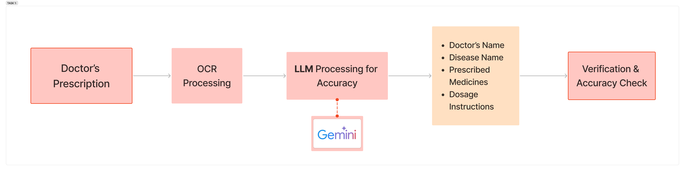

# Pharmacist Assistance System

## Overview

The Pharmacist Assistance System automates prescription matching by using OCR (Google Vision API/Tesseract OCR) to scan handwritten prescriptions and LLMs (Google Gemini) to extract structured data like doctor’s name, disease, prescribed medicines, and dosage. The system verifies medicine accuracy against a drug database and checks stock availability in a PostgreSQL/Firebase inventory system. If medicines are unavailable, pharmacists can place orders through a vendor API. Billing is processed with Stripe API, applying discounts if the pharmacy has a tie-up with the doctor. Monthly, sales data is analyzed using Pandas, Matplotlib, and Power BI to detect disease trends and predict future medicine demand with AI models (Sci-kit Learn/TensorFlow), enabling better stock management. The system is divided into three tasks: (1) Prescription Processing, (2) Order Processing & Billing, and (3) Monthly Analytics & Forecasting, ensuring efficiency, accuracy, and optimized inventory management.

## Objective

The objective of the Pharmacist Assistance System is to automate and optimize prescription processing, stock management, and sales analytics using OCR, AI, and predictive analytics. The system ensures accurate extraction of handwritten prescriptions, verifies medicine details, checks stock availability, and streamlines order placement. It also facilitates automated billing with dynamic discounts and leverages sales data to identify seasonal disease trends, enabling pharmacies to predict future medicine demand and maintain optimal stock levels. This solution enhances efficiency, reduces errors, and improves patient service while providing data-driven insights for better inventory management.

## Our Approach

### Task 1: Prescription Scanning, Recognition & Verification

#### Steps :

##### 1.Handwritten Prescription Upload

- User uploads an image of the prescription.
- Image is pre-processed using OpenCV (grayscale, noise reduction).

##### 2.OCR Processing

- The cleaned image is passed through Tesseract OCR or Google Vision API for text extraction.

##### 3.LLM Processing for Accuracy

- Extracted text is sent to Google Gemini API or OpenAI GPT-4 API for structured output.
  &nbsp;&nbsp;_LLM processes and extracts:_
  &nbsp;&nbsp;&nbsp;&nbsp;1. Doctor’s Name
  &nbsp;&nbsp;&nbsp;&nbsp;2. Patient’s Disease
  &nbsp;&nbsp;&nbsp;&nbsp;3. Medicines & Dosage

##### 4.Verification Against Medical Database

- Compare extracted medicine names against a drug database (FDA/National Medicine Database API) to validate correctness.
  If mismatches are found, prompt the pharmacist for manual correction.

##### APIs Used:

1. **Google Vision API** → OCR for text extraction.
2. **OpenAI GPT-4 API / Google Gemini API** → For structuring extracted data.
3. **National Drug Database API (RxNorm, OpenFDA API)** → Medicine verification

### Task 2:Stock Availability, Order Processing & Billing

#### Steps:

##### 1. Check Medicine Stock

- After verification, the extracted medicines are checked against the pharmacy inventory database (stored in PostgreSQL/Firebase).

##### 2. Order Processing

- If the medicine is **available**, the order is placed, and the stock is updated accordingly.
- If the medicine is **partially available**, the pharmacist is prompted to place an order with a vendor, and the expected delivery date is provided.
- If the medicine is **out of stock**, the system automatically suggests vendor ordering, ensuring timely restocking

##### 3. Vendor Order Management

- If out of stock, the pharmacist can place an order with a vendor API (like McKesson API, Medline API).

##### 4.Billing & Discounts

- If the pharmacy has a tie-up with the doctor, the system applies a discount.
- Discount rules are stored in the database (mapped between doctors & pharmacies).
- GPay API is used for payment processing (if online payments are enabled).

##### APIs Used:

- **Internal Inventory API** (Custom API in Node.js/Python) → To check stock.
- **Vendor API** (McKesson API, Medline API, or custom vendor integration) → For restocking.
- **GPay API** → For online payments.
- **Firebase Realtime DB** → For real-time inventory updates.

### Task 3: Monthly Medicine Tracking & Analytics

#### Steps:

##### 1. Track Sales Data

- very sale is logged in a database with details (date, disease, medicine name, quantity, doctor).

##### 2.Generate Monthly Reports

- Python’s Pandas + Matplotlib or Power BI can generate reports on:
  &nbsp;&nbsp; - Most Sold Medicines
  &nbsp;&nbsp; - Seasonal Disease Trends
  &nbsp;&nbsp; - Stock Reordering Predictions

##### 3.Predictive Analytics

- AI-based forecasting can predict demand for upcoming months based on past trends using ML models (Facebook Prophet, Sci-kit Learn).

##### 4.Automated Alerts for Stock Replenishment

- If a medicine is in high demand during a season, the system can automatically recommend pre-ordering before stock runs out.

##### APIs Used:

- **Google BigQuery API / Power BI API** → For advanced analytics.
- **Sci-kit Learn / TensorFlow** → For predictive analysis.
- **Firebase Realtime DB** → For real-time tracking of sales.

## Tech Stack

 

| Component             |                             Technology                             |
| :-------------------- | :----------------------------------------------------------------: |
| Frontend              |                    React.js / Next.js (for UI)                     |
| Backend               |             Node.js with Express.js / FastAPI (Python)             |
| Database              | PostgreSQL / MySQL(Relational DB) & MongoDB(for unstructured data) |
| OCR Processing        |                 Tesseract OCR / Google Vision API                  |
| LLM Processing        |                OpenAI GPT-4 API / Google Gemini API                |
| Stock Management      |                  Firebase Realtime DB / PostgreSQ                  |
| Authentication        |                       Firebase Auth / Auth0                        |
| Billing & Payments    |                              GPay API                              |
| Analytics & Reporting |         Power BI / Tableau / Python (Pandas + Matplotlib)          |
| Deployment            | AWS (EC2, S3), Vercel (for Frontend), Docker for containerization  |

##  Integration of All Three Tasks

1. **Frontend (React/Next.js)** handles UI for prescription upload, stock updates, order placement, and billing.
2. **Backend (Node.js/FastAPI)** handles APIs for:
- OCR Processing
- LLM Verification
- Stock Management
- Order Processing
- Billing
- Analytics
3. **Database (PostgreSQL/Firebase)** stores:
- Prescriptions & Medicines
- Stock Data
- Sales Data
- Doctor-Pharmacy Tie-ups for Discounts
4. **Periodic Cron Jobs (Node.js or Python)** run monthly analytics to generate disease trend reports.

 
